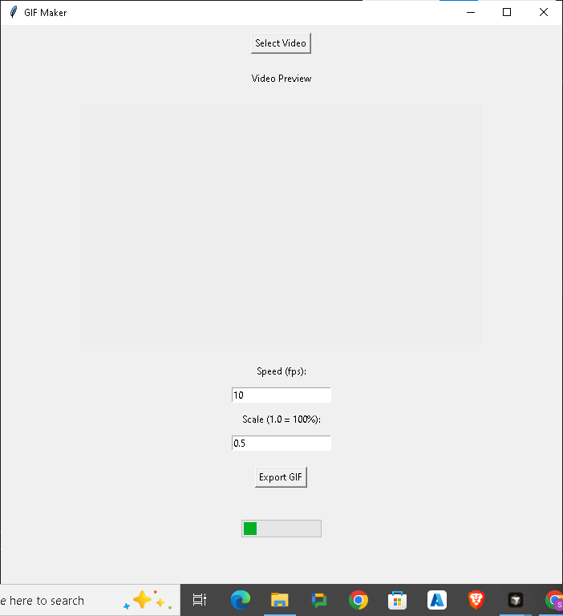
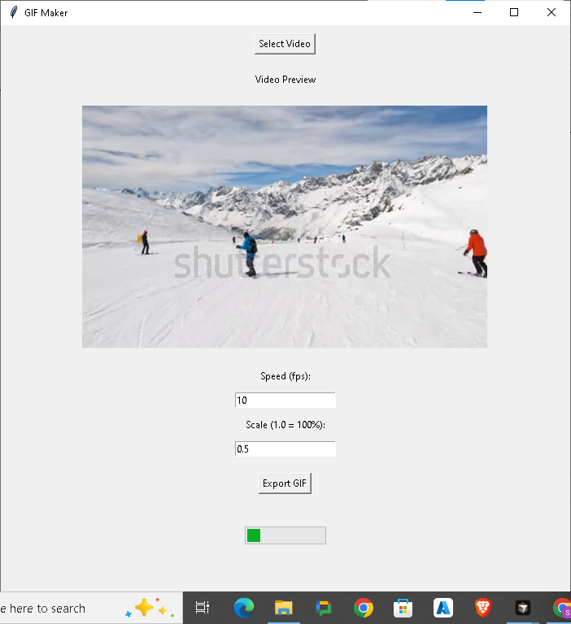
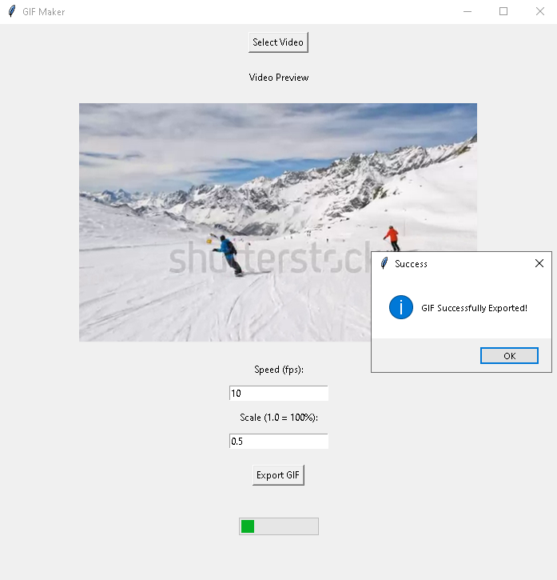

# GIF Maker

A simple and intuitive desktop application for converting video files into GIF animations with customizable speed and scale settings.

## Features

- Convert MP4 videos to GIF format
- Real-time video preview
- Adjustable playback speed (FPS)
- Customizable scale/resolution
- Clean and user-friendly interface
- Easy file selection and export

## Requirements

- Python 3.7+
- tkinter (usually comes with Python)
- OpenCV (cv2)
- Pillow (PIL)

## Installation

1. Clone this repository:
```bash
git clone https://github.com/sivaprasanth2221/GIF-Maker-in-Python.git
cd GIF-Maker-in-Python
```

2. Install required dependencies:
```bash
pip install opencv-python pillow
```

## Usage

1. Run the application:
```bash
python main.py
```

2. Click **Select Video** to choose an MP4 file
3. Preview the video in the canvas area
4. Adjust settings:
   - **Speed (fps)**: Set the frames per second for the GIF (default: 10)
   - **Scale**: Set the size ratio (1.0 = 100%, 0.5 = 50%, default: 0.5)
5. Click **Export GIF** to save your animation
6. Choose the output location and filename

## Configuration Options

| Option      | Description                      | Default | Example                      |
|-------------|----------------------------------|---------|------------------------------|
| Speed (fps) | Frames per second in output GIF  | 10      | 15 for faster, 5 for slower  |
| Scale       | Resize ratio for the output      | 0.5     | 1.0 for full size, 0.3 for smaller |

## Screenshots

### Main Interface


### Video Preview


### Export Dialog


## How It Works

1. The application reads the selected video file frame by frame using OpenCV
2. Frames are stored in memory and displayed as an animated preview
3. On export, frames are resized according to the scale parameter
4. The GIF is created with the specified FPS using Pillow
5. Processing happens in a separate thread to keep the UI responsive

## Limitations

- Currently supports MP4 files only (can be extended to other formats)
- All frames are loaded into memory (large videos may require significant RAM)
- Preview always shows at 10 FPS regardless of export settings

## Future Enhancements

- Support for more video formats (AVI, MOV, etc.)
- Trim/crop functionality
- Frame selection (start/end points)
- Compression options
- Batch processing
- Preview with actual export FPS

## Contributing

Contributions are welcome! Please feel free to submit a Pull Request.

## Author

https://github.com/sivaprasanth2221

## Acknowledgments

- Built with Python, tkinter, OpenCV, and Pillow
- Inspired by the need for a simple video-to-GIF converter
